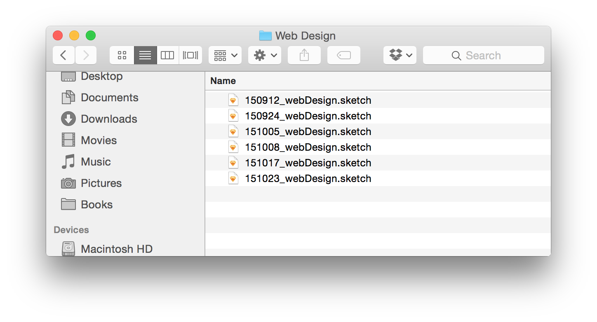
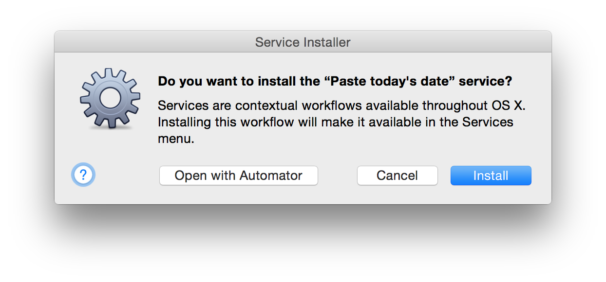
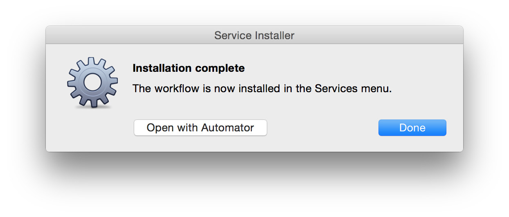
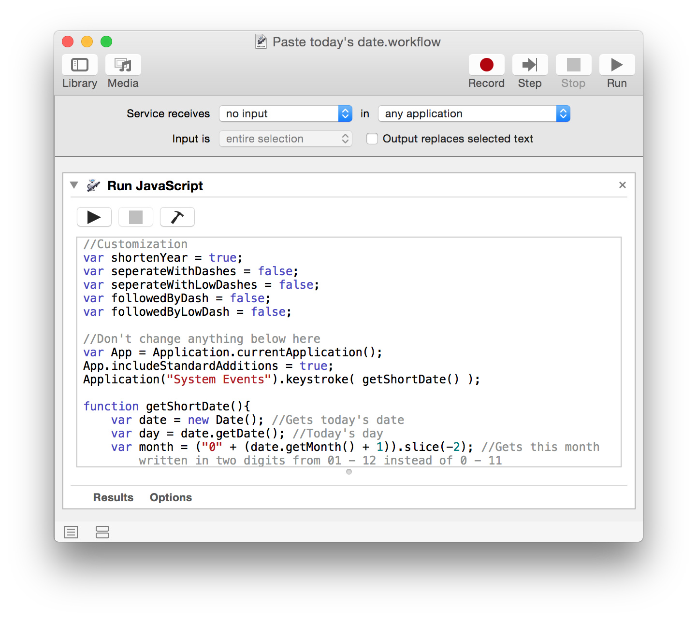
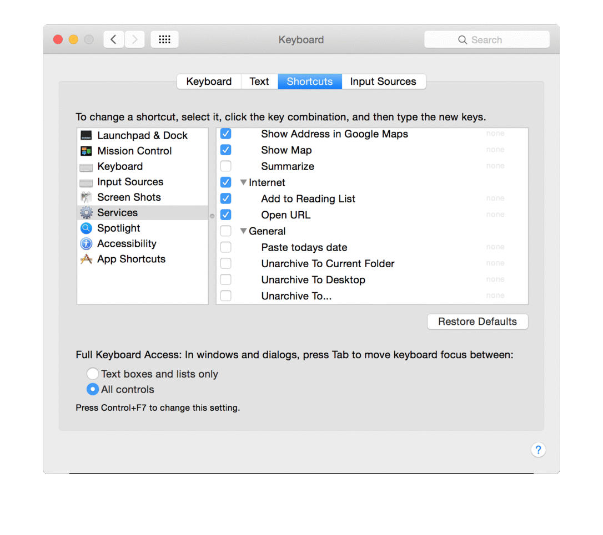

# Paste Today's Date
## Why it's useful
If you ever used **"version 1 final"**, **"version 3 final final"**, **"final version final 28"** or something similar you know that stuff isn't working as it should.

By adding the date as a prefix you always know how old your work is and it always gets sorted the right way. But adding it manually can be tedious. This **Automator script for Mac** handles this automatically.

## Setup
### 1. Download and installation
Download the file ["Paste today's date.workflow"](), open it and hit install.

### 2. (Optional) Customization
By default the script would add the prefix as `YYMMDD` (e.g. `150820` for the 20th of August 2015).

If you want to change it, select **"Open with Automator"** instead of completing the installation.

This will open an application called **Automator**, you have to change a few lines of code to customize the prefix, but don't worry, you don't need to know how to code to do that.

- **"shortenYear = true"** will paste the year with two digits, e.g. **15 for 2015**
- **"shortenYear = false"** will use four digits instead, e.g. **2015 for 2015**
- **"seperateWithDashes = true"** seperates month, day and year with dashes, e.g. **"2015-08-20"**
- **"seperateWithLowDashes = true"** results in something like **"2015_08_20"**
- **"followedByDash = true"** adds a dash after the date, e.g. **"2015_08_20-"**
- **"followedByDash = true"** adds a lowdash after the date, e.g. **"2015_08_20_"**

### 3. Setup your shortcut
Goto ` ▶ System Preferences... ▶ Keyboard` select the **Shortcuts** tab and **Services** on the left. Then **scroll to the very bottom** and you'll find our script. 

**Turn it on** and set a shortcut you like.

### 4. Done
Use the shortcut and enjoy saving time!

## License
Public Domain